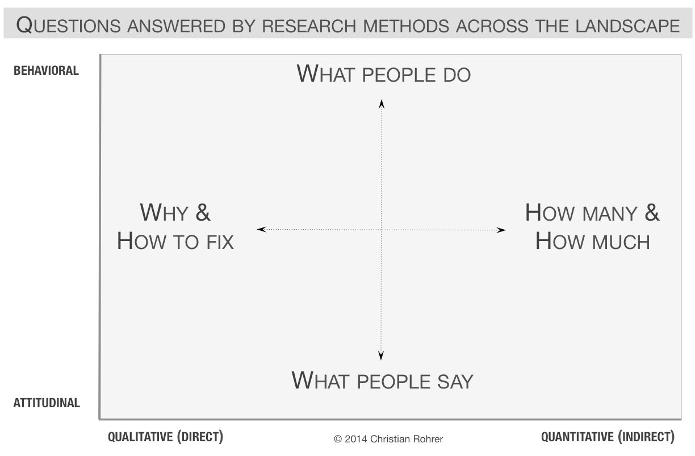

# Designing a survey {#macro}

## Choosing a research method 

First, establish if a survey is the right method to accomplish your research goal.  
 
Below are two useful visualizations from the Nielsen Norman group on how to decide between which qualitative or quantitative methods to answer your research goal [@nng_method].  

Surveys are great for answering the **"How many and how much"** of what people do and say; surveys are *not* the best method at understanding the **"Why and how to fix"** a product problem. 


```{r echo=FALSE, fig.align='center'}
knitr::include_graphics("figs/nng_ux_methods_chart2.png")

```




## Selecting your target population 

Once you've determined your research goal, it's important to determine your target audience. In an ideal world, we'd sample the entire population of interest. But because of resource constraints (i.e. it can be expensive to run a survey, we don't want to exhaust our population/prevent them from taking future surveys), we have to be deliberate in who we select into our study. 

A common question asked is: *"How many people do I need to survey?"* 
The answer to this question is entirely dependent on the level of power and effect size your team is targeting. When determining you survey's sample size, your goal should be to collect a large enough sample to have sufficient power to detect a meaningful effect. 


## Total survey error framework  

There are two types of errors that commonly arise in surveys.  
  
- **Measurement error:** how well do our survey questions measure the constructs of interest (e.g. construct validity, measurement error, processing error)  
- **Representation error:** how much does our survey statistic generalize to our target population (e.g. coverage error, sampling error, nonresponse error, adjustment error)